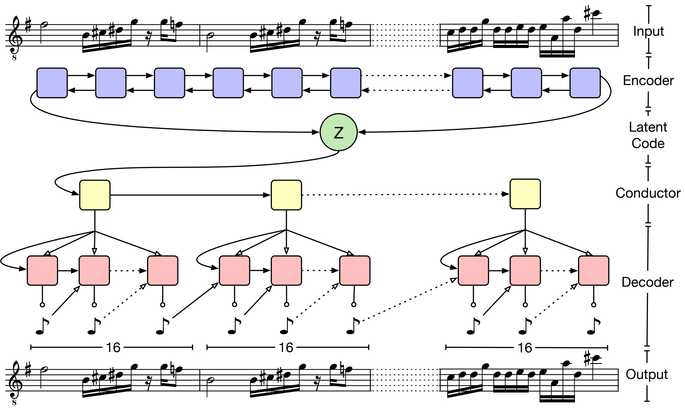
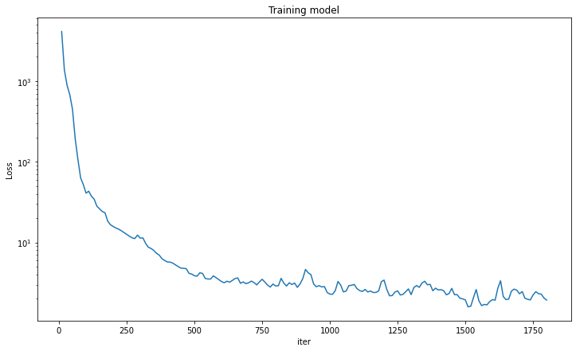

# README

# Pytorch implementation of musicVAE

Based on the following paper :

**A Hierarchical Latent Vector Model for Learning Long-Term Structure in Music**

[https://arxiv.org/abs/1803.05428](https://arxiv.org/abs/1803.05428)

---

You can easily prepare data and train the model.

Adjusting arguments and model and training parameters is not yet supported.

# Requirements

It has been tested in the Google Colab (A100 GPU) environment. Additional package installation may be required when running in other environments.

```python
pip install miditok==1.4.3
```

# Model

The model has been implemented faithfully to the content of the paper. However, there are still parts that need to be reviewed. 

**The input and output of the model are shown below.**

input = (batch_size, sequence_length) 

output = (batch_size, probabilities)

**Models are designed to follow the structure shown in the figure below.**



figure of whole model structure

**The main tensor transfer implemented in the model(Some parts must be verified to be correct)**

- hidden state of the last layer of the encoder → latent z
- latent z → fully connected layer and tanh → hidden state of the first layer of the conductor
- fixed tensor (learnable) → input of the conductor
- c embeddings → input of the Decoder
- c embeddings → fully connected layer and tanh → hidden state of the first layer of the Decoder

# Data preparation

The groove-v1.0.0-midionly.zip data is automatically downloaded to prepare the training dataset.

[Groove MIDI Dataset](https://magenta.tensorflow.org/datasets/groove)

```python
python data.py
```

The miditok tokenizer library was used for data preprocessing, but this tokenizer may differ from the way it is presented in the paper.

# Training

It is set to train for a short time (1 hour, A100 GPU). If trained for a longer time, better results may be obtained.

```python
python train.py
```



# Further work

- Latent space analysis (ex : UMAP)
- Latent space interpolate, modulation
- Model parameter optimization, regularization
- Training method optimization

Thank you!
